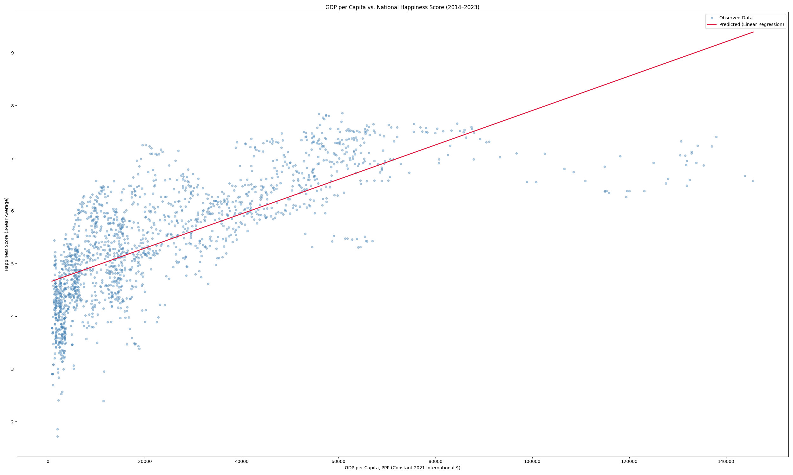
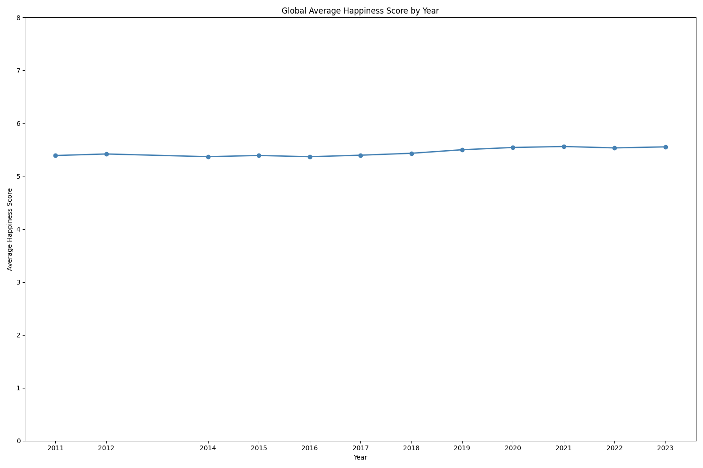
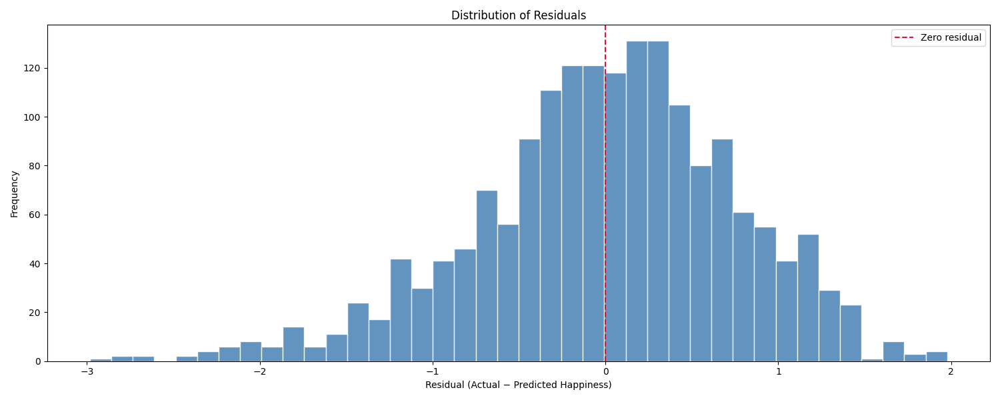
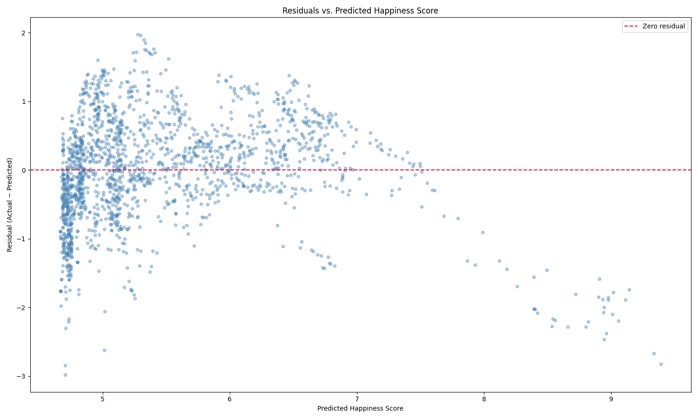

# MA705-Project2-WorldHappinessAndGDPperCapita
Submission for Project 2 of Spring 2026 MA705 Class 

## File structure
- Original (Unmodified) data and the links to hosting sources are available in [The Original Data Folder](OriginalData) and [Sources document](OriginalData/sources.md), respectively
- Merged Dataset, as created by [The Setup notebook](Setup.ipynb) can be found in [The Modified Data Folder](ModifiedData)
- [The Report](Report.docx), [The Setup notebook](Setup.ipynb), [Graphing Notebook](Graphing.ipynb) and [Analysis Notebook](Analysis.ipynb) can be found in the root directory
- [Visualizations](Visualizations) all in linked folder

## ToDo:
- [x] Create analysis notebook that identifies correlation of GDP per capita and happiness and GDP per capita's weight in calculating Happiness Score
- [x] Graph GDP per Capital vs Happiness score and plot line of best fit, and identify any interesting correlations, such as initial upwards trend then falling off, as with happiness versus income
- [x] Create .docx Report as defined in [Project Assignment](Project-2-assignment.pdf)
- [x] Convert report to markdown format and add as a section in [the README](README.md)

# Report: Does Wealth Predict Happiness?
## A Merged Analysis of GDP per Capita and World Happiness Scores
### Summary
In this project we explored whether countries with higher GDP per capita also tend to report higher happiness scores. We looked into two public datasets: one containing GDP per capita by country and year from the World Bank, and another containing national happiness from the World Happiness Report. Once cleaning up the datasets by their country names and merging the two datasets togethers by country and year, the final dataset included 1,765 observations from 160 countries. We then created a linear regression model to measure the relationship between GDP per capita and happiness. The resulting graphs and numbers show a strong positive relationship: countries with higher GDP per capita generally had higher happiness scores. We also noticed that the model showed that money alone does not fully explain happiness, especially among wealthier countries. 

### Project Goal
The key question we were trying to answer is: How strongly is GDP per capita related to a country’s reported happiness score? 
This is an important question to look into and answer because GDP per capita is often used as a simple measure of a country’s standard of living, but happiness is more complicated than income alone. Just because a country is wealthy does not automatically mean its citizens report the highest life satisfaction. We use this data and report to look at whether economic strength is a useful predictor of happiness while also recognizing that social, political, health, and cultural factors really matter too. 

### Data Sources
When it came to finding out data, we used multiple different sites to find strong and reliable data that would help us answer our question. We ended up choosing the GDP per capita dataset from the World Bank and downloaded it through Kaggle. The key columns and data we were interested in are the countries, years, and GDP per capita which was measured in constant 2021 international dollars adjusted for purchasing power parity. This just means that the measure adjusts for price differences between countries, making it easier to compare economic output across nations. 	
From there, we needed to find a second data set that has to do with happiness ratings from people across the world. We found a dataset from the World Happiness Report 2026. It contained each country’s happiness ranking and its Life evaluation score, 3-year average happiness measure. The following columns from the dataset are things such as explaining happiness scores like social support, health life expectancy, generosity, perceptions of corruption, and freedom to make like choices. We did not do any analysis with these columns and focused on just the raw ranking score to compare to the same country’s GDP per capita to respond to our initial question. 
The key thing that makes these two datasets helpful for our analysis is that both contain a country and year column so merging the two together will not be that difficult. From there we can use that final large dataset to easily do some exploratory analysis to respond to our question above. 

### Data Cleaning and Merge Process
Now that we have our data sets, we need to merge them so we can conduct our analysis about the relationship between GDP per capita and happiness, but first we need to do some slight data cleaning. Across the two datasets, some country names slightly differed from each other. A few examples are that in the GDP data set names like “South Korea” and “Russia” where in the happiness dataset they are written as “Republic of Korea” and “Russian Federation”. In order to have a successful merge, we needed to have a column in each dataset where the names match exactly. To achieve that we first tested to see which ones had different names than created some python code to edit them and get resulting columns that match perfectly. 
Once this cleaning step was complete, we were finally ready to merge. We merged the datasets using the Country name and Year column to get the best merge possible. Now in our final merged dataset, each row represents one country in one year with both its GDP per capita and happiness score data included. Our final dataset contains 1,765 rows and 15 columns and covers data for 160 counties in the year 2011, 2012, and 2014 through 2023. We did have to leave out a few countries’ happiness data like Cuba, Venezuela, Yemen, and others because they did not have matching data in the GDP per capita dataset. We did one final check before we completed our analysis, making sure no duplicate rows and no missing values were present. 

### Exploratory Analysis
The first visual we constructed on this data was a scatterplot of GDP per capita versus happiness score. This graph shows a clear upward trend that countries with higher GDP per capita generally had higher happiness scores. So, poorer countries tend to have lower happiness scores, while wealthier countries tend to score higher. However, this relationship does not appear to be perfect. At lower levels of GDP, happiness scores seem to have lots of variation and at higher GDP levels, the line of best fit seems to overestimate happiness by quite a bit. Now while the basic trend still holds true, this may suggest that once a country reaches a certain level of economic comfort, additional wealth may not increase happiness as much as it did at lower GDP levels. 

We also decided to create another visual that shows the average happiness score by year to see if there was an increase in average happiness over time. Looking at the graph, we can see a fairly straight line with a slight drop during the years around the COVID-19 pandemic, suggesting that average happiness remains stable. Therefore, our initial thought of average happiness scores increasing over time was incorrect and that is truly a constant relationship and there is no apparent increase in average happiness scores over time. 

### Statistical Analysis
For there, we used simple linear regression to create an exact model for our data that responds to our question. We have our response variable as country’s happiness score and the explanatory variable being GDP per capita. The equation we came up with was:
Predicted Happiness = 0.0000327(GDP per capita) + 4.638
According to our model, countries with higher GDP per capita are predicted to have higher happiness scores. From our regression, we got an extremely small p-value, 3.07 x 10^-299, which means the relationship between these two variables is statistically significant. It is very unlikely that this pattern appeared by random chance. The correlation between these two was about 0.735, which shows a strong positive relationship between the variables. The R-squared value is about 0.540. This means that GDP per capita explained around 54% of the variation in happiness scores. 

### Model Diagnostics
When doing regression like this we need to check 3 key assumptions that allow us to use our results. They are independence, normality, and constant variance. The independence assumption is met through the data itself since it contains GDP per capita and happiness data across multiple years and are independent of one another. The normality assumption is met in the histogram visualization. This shows the residuals of the data normally distributed around zero, a bell curve. To check the final assumption of constant variance, we look at the residuals plot and see that the points are relatively evenly distributed around zero, above and below. There all 3 assumptions are met, and we can confirm that our results are statistically significant and can be used. 

The residual plot also helps show where the model performed well and where it struggled. A residual itself is the difference between the actual happiness score and the model’s predicted score. Our model does fairly well with residuals being great than a difference of 3 but it also shows what we noted before how our model overestimates a lot of the happiness scores at higher GDP per capita level. 

### Key Findings, Limitations, and Conclusion 
Our analysis found that GDP per capita and happiness have a strong positive relationship. Countries that have a high GDP per capita usually report higher happiness scores. The linear regression model confirms this relationship by finding it statistically significant, and GDP per capita explain about 54% of the variation in happiness scores. 
Although GDP per capita was a meaningful predictor, it may not be the full story. With nearly half the variation being due to other factors not in the model, we may want to go on to do further research and analysis with more data in the future to help explain what truly does affect happiness scores. Some things we have in mind are social support, health, freedom, trust in institutions, or inequality that could possibly improve our model and help explain happiness scores more than just using GDP per capita. This analysis we did is also only measured through association rather than causation, therefore we cannot come to any casual claims about how GDP directly causes greater happiness. 
Overall, our results suggest that wealth strongly influences happiness, and that a high correlation coefficient was recorded. Particularly at lower income levels where economic growth can improve living standards the most is where we saw the highest correlation between the two variables. It appears that long-term well-being depends on much more than income alone though. Therefore, a country’s quality of life is shaped largely by economic success but also slightly by some other broader social conditions. 
